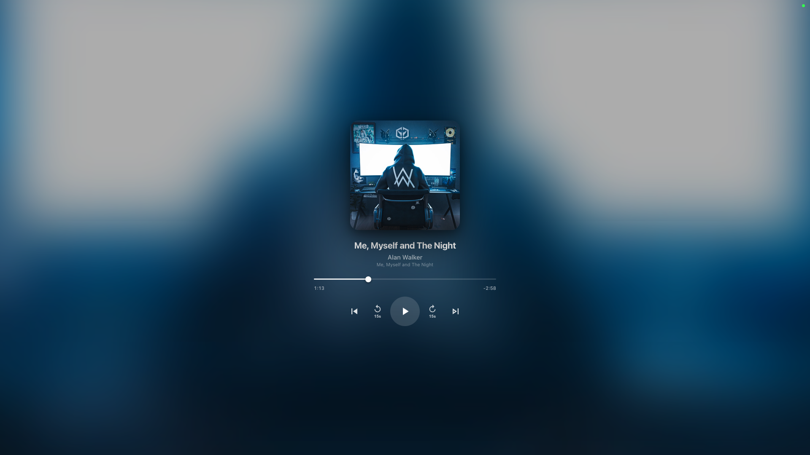
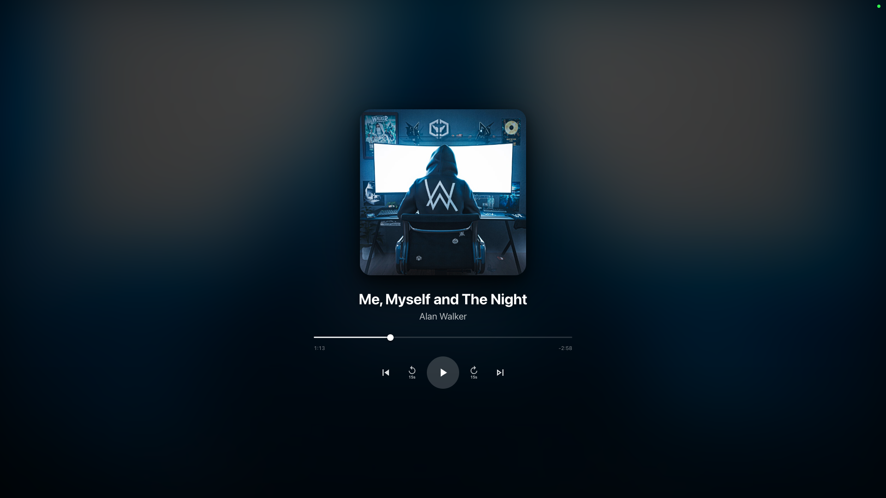
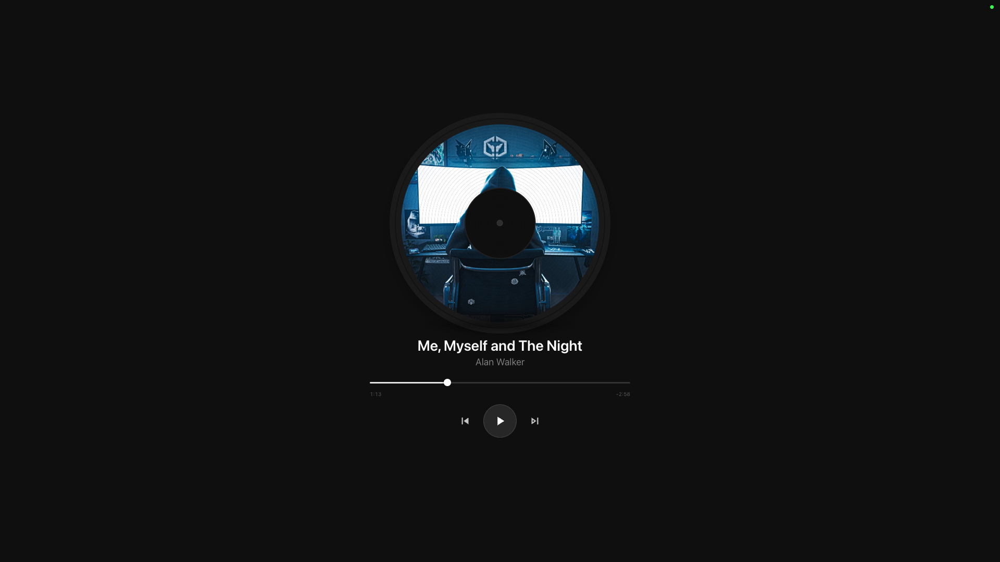
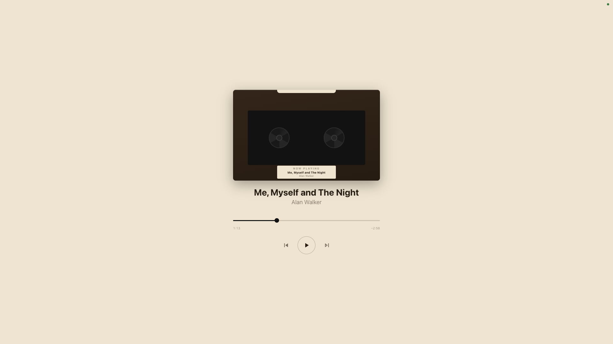
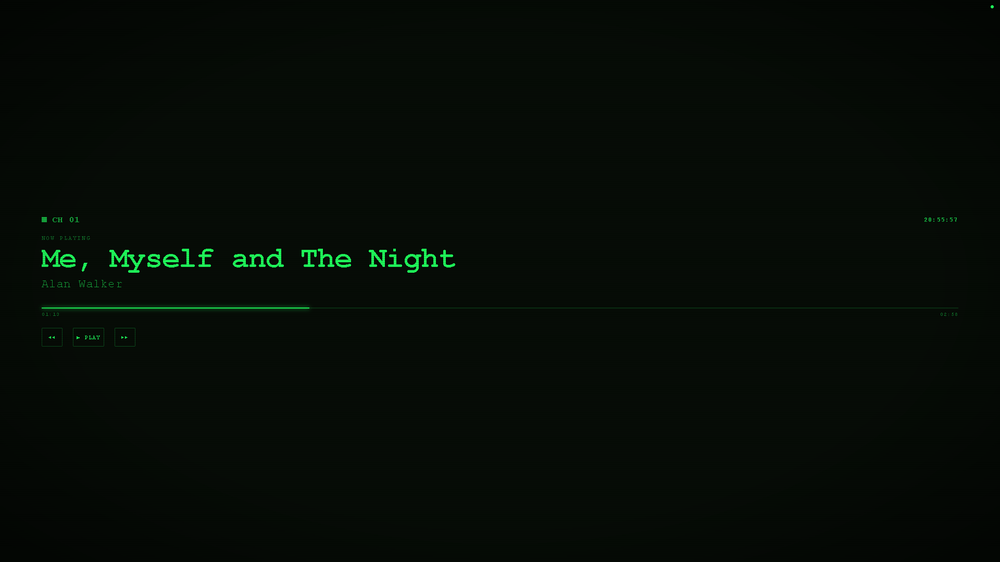
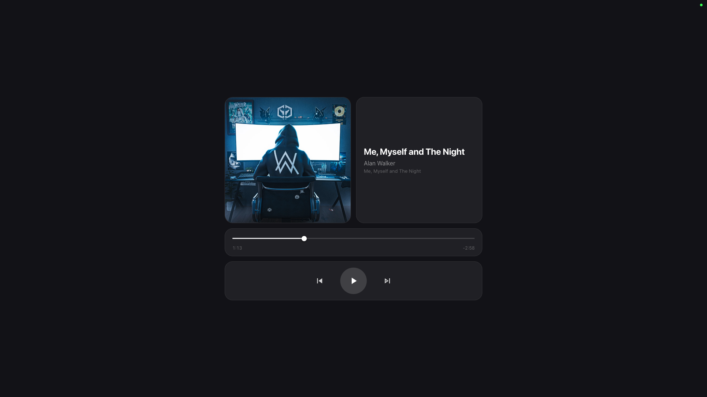
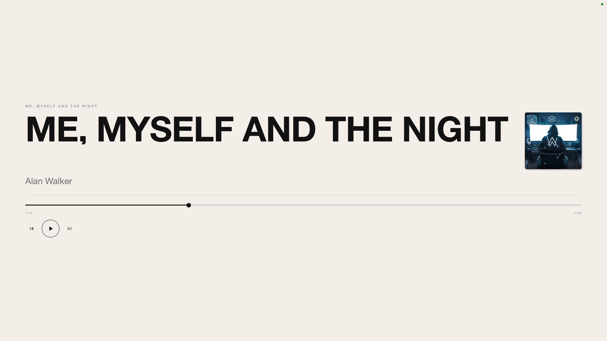

# Themes Gallery

Now Playing Remote comes with 10 beautifully designed built-in themes. Each theme offers a unique visual style and can be customized further with custom CSS/JavaScript archives.

## Clean (Default)

The modern, versatile default theme with a blurred album art background and full playback controls.

**Features:**
- Blurred album artwork background
- Color-extracted gradient overlay
- Full playback controls (play, skip, shuffle, repeat)
- Volume control support
- Lyrics panel with sync support

<div align="center">
  
  
</div>

---

## Immersive

A cinematic full-screen experience with the album artwork as a large background fill.

**Features:**
- Full-screen blurred artwork fill
- Content floats centered on top
- Minimalist control layout
- Perfect for focus and immersion

<div align="center">
  
</div>

---

## Minimal

Ultra-clean text-only interface. No artwork, just essential information and controls.

**Features:**
- Text-only display (title, artist, album)
- Thin progress bar
- Three control dots (minimal UI)
- Perfect for distraction-free listening
- Lyrics support with clean display

<div align="center">
  
</div>

---

## Vinyl

A nostalgic theme featuring a spinning record with a dark platter shadow. The record pauses when playback stops.

**Features:**
- Animated spinning vinyl record
- 3D platter shadow effect
- Record stops spinning when paused
- Dark, vintage aesthetic
- Lyrics support

<div align="center">
  
  
</div>

---

## Cassette

Skeuomorphic design inspired by vintage audio cassettes. Features animated reels and a warm beige palette.

**Features:**
- Realistic cassette shell design
- Animated rotating reels
- Warm beige and brown color scheme
- Nostalgic 1980s aesthetic
- Tactile, retro feel

<div align="center">
  
</div>

---

## VHS / Late-Night

Inspired by 1990s VHS aesthetic with scanlines, glitch effects, and phosphor-green text on black.

**Features:**
- Scanline overlay effect
- CSS glitch animation on title
- Phosphor-green text color
- Clock timestamp display
- Dark, moody 90s vibe
- Lyrics support with styled display

<div align="center">
  
  
</div>

---

## iPod Classic

Retro click-wheel interface with a green LCD screen aesthetic. Takes you back to the golden age of portable music.

**Features:**
- Click-wheel interface navigation
- Green LCD screen design
- Pixelated retro aesthetic
- Classic iPod controls
- Highly interactive and playful

<div align="center">
  
</div>

---

## Bento

Modern grid-based layout with rounded cards for artwork, info, progress, and controls.

**Features:**
- Grid card layout system
- Rounded card design
- Separated sections (art, info, progress, controls)
- Clean, modern aesthetic
- Responsive card sizing
- Lyrics support with card-based display

<div align="center">
  
  
</div>

---

## Starry Sky

Ambient theme with animated shooting stars and aurora borealis gradient background.

**Features:**
- Canvas-based shooting stars animation
- Aurora borealis gradient background
- Dynamic particle effects
- Calming, meditative atmosphere
- Perfect for long listening sessions
- Lyrics support with elegant display

<div align="center">
  
  
</div>

---

## Poster

Print-design inspired theme with a monochrome palette and giant title display.

**Features:**
- Minimalist print-style design
- Large, bold typography
- Small artwork square
- Monochrome color palette
- High contrast, editorial aesthetic

<div align="center">
  
</div>

---

## Creating Custom Themes

Don't see a style you like? Create your own! 

See [THEME_DEVELOPMENT.md](THEME_DEVELOPMENT.md) for a complete guide on building custom `.theme` archives with:
- Custom CSS styling
- JavaScript interactions
- Custom assets (images, fonts, SVGs)
- Full control over layout and behavior

### Quick Start
1. Create a folder with `theme.json`, `styles.css`, and optional `script.js`
2. Add any custom assets to an `assets/` subfolder
3. Zip the folder and rename to `.theme`
4. Import via Settings → Custom Player → Theme → Import

### Example Theme Structure
```
my-theme/
├── theme.json          # Metadata (name, author, version)
├── styles.css          # Custom styles
├── script.js           # Custom behavior (optional)
└── assets/
    ├── background.jpg
    └── custom-font.woff2
```

---

## Theme Capabilities

Not all themes support the same features:

| Theme | Lyrics | Volume Control | Skip Interval |
|-------|--------|-----------------|---------------|
| Clean | ✅ | ✅ | ✅ |
| Immersive | ❌ | ❌ | ❌ |
| Minimal | ✅ | ❌ | ❌ |
| Vinyl | ✅ | ❌ | ❌ |
| Cassette | ❌ | ❌ | ❌ |
| VHS | ✅ | ❌ | ❌ |
| iPod | ❌ | ❌ | ❌ |
| Bento | ✅ | ❌ | ❌ |
| Starry Sky | ✅ | ❌ | ❌ |
| Poster | ❌ | ❌ | ❌ |

**Note:** Settings controls are hidden for themes that don't support them. Custom themes can opt into any feature by setting the appropriate flags in `theme.json`.

---

## Tips for Choosing a Theme

- **General Use** → Clean (default, full features)
- **Focus/Immersion** → Immersive or Minimal
- **Nostalgia** → Vinyl, Cassette, VHS, or iPod Classic
- **Modern Look** → Bento or Starry Sky
- **Minimalist** → Poster or Minimal
- **Ambiance** → Starry Sky (great for long sessions)

---

## Browser Compatibility

All built-in themes work on:
- Safari (macOS and iOS)
- Chrome / Edge (macOS, Windows, Android)
- Firefox (all platforms)

For best results on mobile, add the theme to your home screen:
1. Open `http://<your-mac-ip>:8080` in Safari
2. Tap Share → Add to Home Screen
3. Launch in full-screen mode

---

## Next Steps

- [Getting Started](GETTING_STARTED.md) — Learn how to change themes
- [Theme Development](THEME_DEVELOPMENT.md) — Create a custom theme
- [Settings Guide](GETTING_STARTED.md#🎛️-settings--customization) — Configure theme options

